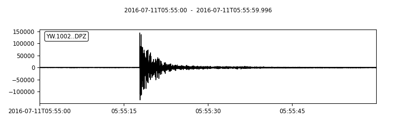

Data Structure
===================
The following datasets are required:

	1. ``Obspy.Stream`` with station metadata added.
	2. Station ``Subnetworks``.

1. ObsPy.Stream with station metadata added
-------------------------------------------
An ``ObsPy.Stream`` object contains a number of ``Obspy.Trace`` objects. Station coordinates are to be attached to each ``Obspy.Trace``. Optionally, station response information can also be attached to ``Obspy.Trace``. Let's follow the `ObsPy example <https://docs.obspy.org/packages/obspy.clients.fdsn.html>`_ to download data and metadata.

>>> from obspy import UTCDateTime
>>> from obspy.core import AttribDict
>>> from obspy.clients.fdsn import Client
>>> client = Client("IRIS")
>>>
>>> #--- Define starttime and endtime
>>> starttime = UTCDateTime("2010-02-27T06:45:00.000")
>>> endtime = starttime + 60
>>>
>>> #--- Download Stream
>>> st = client.get_waveforms("IU", "ANMO", "00", "LHZ", starttime, endtime, attach_response=True)
>>>
>>> #--- Download station metadata
>>> inventory = client.get_stations(network="IU", station="ANMO", location="00", channel="LHZ",
>>>				    starttime=starttime, endtime=endtime, level="response")

Station coordinates can be attached to each ``Obspy.Trace`` as shown below.

>>> for tr in st:
>>>	coordinates = inventory.get_coordinates(tr.id, datetime=tr.stats.starttime)
>>>	tr.stats.sac = AttribDict()
>>>	tr.stats.sac.stlo = coordinates['longitude']
>>>	tr.stats.sac.stla = coordinates['latitude']
>>>	tr.stats.sac.stel = coordinates['elevation']
>>>
>>> print(st[0].stats)
               network: IU
               station: ANMO
              location: 00
               channel: LHZ
             starttime: 2010-02-27T06:45:00.069538Z
               endtime: 2010-02-27T06:45:59.069538Z
         sampling_rate: 1.0
                 delta: 1.0
                  npts: 60
                 calib: 1.0
_fdsnws_dataselect_url: http://service.iris.edu/fdsnws/dataselect/1/query
               _format: MSEED
                 mseed: AttribDict({'dataquality': 'M', 'number_of_records': 1, 'encoding': 'STEIM2', 'byteorder': '>', 'record_length': 512, 'filesize': 512})
            processing: ['ObsPy 1.4.0: trim(endtime=UTCDateTime(2010, 2, 27, 6, 46, 0, 69538)::fill_value=None::nearest_sample=True::pad=False::starttime=UTCDateTime(2010, 2, 27, 6, 45, 0, 69538))']
              response: Channel Response
	From m/s (Velocity in Meters Per Second) to counts (Digital Counts)
	Overall Sensitivity: 3.25959e+09 defined at 0.020 Hz
	3 stages:
		Stage 1: PolesZerosResponseStage from m/s to V, gain: 1952.1
		Stage 2: CoefficientsTypeResponseStage from V to counts, gain: 1.67772e+06
		Stage 3: CoefficientsTypeResponseStage from counts to counts, gain: 1
                   sac: AttribDict({'stlo': -106.457133, 'stla': 34.945981, 'stel': 1671.0})

**Alternatively**, the function ``SeisScan.read_fdsn`` can be used to retrive ``ObsPy.Stream`` with station metadata attached. utilizes `FDSN web service client for ObsPy <https://docs.obspy.org/packages/obspy.clients.fdsn.html>`_ to request ``ObsPy.Stream`` object and station metadata (station coordinates and response information). Finally, it attaches the metadata information to each ``ObsPy.Trace`` of the ``Obspy.Stream`` object and returns the ``Obspy.Stream`` object. The following example is similar to the previous example.

>>> import SeisScan as ss
>>>
>>> starttime = UTCDateTime("2010-02-27T06:45:00.000")
>>> endtime = starttime + 60
>>>
>>> st = ss.read_fdsn(starttime, endtime, "IU", "ANMO", "00", "LHZ", provider="IRIS")
>>> print(st[0].stats)
               network: IU
               station: ANMO
              location: 00
               channel: LHZ
             starttime: 2010-02-27T06:45:00.069538Z
               endtime: 2010-02-27T06:45:59.069538Z
         sampling_rate: 1.0
                 delta: 1.0
                  npts: 60
                 calib: 1.0
_fdsnws_dataselect_url: http://service.iris.edu/fdsnws/dataselect/1/query
               _format: MSEED
                 mseed: AttribDict({'dataquality': 'M', 'number_of_records': 1, 'encoding': 'STEIM2', 'byteorder': '>', 'record_length': 512, 'filesize': 512})
            processing: ['ObsPy 1.4.0: trim(endtime=UTCDateTime(2010, 2, 27, 6, 46, 0, 69538)::fill_value=None::nearest_sample=True::pad=False::starttime=UTCDateTime(2010, 2, 27, 6, 45, 0, 69538))']
              response: Channel Response
	From m/s (Velocity in Meters Per Second) to counts (Digital Counts)
	Overall Sensitivity: 3.25959e+09 defined at 0.020 Hz
	3 stages:
		Stage 1: PolesZerosResponseStage from m/s to V, gain: 1952.1
		Stage 2: CoefficientsTypeResponseStage from V to counts, gain: 1.67772e+06
		Stage 3: CoefficientsTypeResponseStage from counts to counts, gain: 1
                   sac: AttribDict({'stlo': -106.457133, 'stla': 34.945981, 'stel': 1671.0})

2. Station Subnetworks
----------------------
A ``Subnetwork`` is a station cluster where the central station is defined as the reference station, whereas the remaining stations are called secondary stations. It is represented by a ``Dictionary`` with two keys, ``"reference"`` and ``"secondaries"``. The value of ``"reference"`` is the central station code and the value of ``"secondaries"`` is a ``List`` of secondary station codes. An example is given below.

>>> subnetwork = {"reference": "STA01", "secondaries":["STA02", "STA03"]}

Reading seismograms from the ObsPy FDSN web service
---------------------------------------------------
The ``SeisScan.read_fdsn`` function utilizes `FDSN web service client for ObsPy <https://docs.obspy.org/packages/obspy.clients.fdsn.html>`_ to request ``ObsPy.Stream`` object and station metadata (station coordinates and response information). Finally, it attaches the metadata information to each ``ObsPy.Trace`` of the ``Obspy.Stream`` object and returns the ``Obspy.Stream`` object.

Let's do the following example. In a python file or jupyter notebook cell, type the following commands to import some important libraries.

.. note::

    Don't forget to replace "path-to-SeisScan-directory" by SeisScan absolute path.

>>> import sys
>>> from obspy import UTCDateTime
>>>
>>> SeisScan_path = "path-to-SeisScan-directory"
>>> sys.path.insert(0, SeisScan_path)
>>>
>>> import SeisScan as ss

Now, it's time to pull some data from IRIS FDSN with the following parameters.

>>> provider = "IRISPH5" # key string for FDSN web server
>>> network = "YW"
>>> station = "1002"
>>> location = ""
>>> channel = "DPZ"
>>> attach_coordinates = True
>>> attach_response = True
>>> starttime = UTCDateTime('2016-07-11 05:55:00')
>>> endtime = starttime + 60

Hit the following commands to pull data.

>>> st = ss.read_fdsn(starttime, endtime, network, station, location, channel, provider=provider)

Print the first ``trace stats`` to check the contents. This is just a regular ``ObsPy Trace stats`` object with two extra attributes.
Attribute ``response`` contains intrument response information and attribute ``sac`` contains station coordinates.
The station coordinates are important for further computation.

>>> print(st[0].stats)
               network: YW
               station: 1002
              location: 
               channel: DPZ
             starttime: 2016-07-11T05:55:00.000000Z
               endtime: 2016-07-11T05:55:59.996000Z
         sampling_rate: 250.0
                 delta: 0.004
                  npts: 15000
                 calib: 1.0
_fdsnws_dataselect_url: http://service.iris.edu/ph5ws/dataselect/1/query
               _format: MSEED
                 mseed: AttribDict({'dataquality': 'D', 'number_of_records': 7, 'encoding': 'STEIM2', 'byteorder': '>', 'record_length': 4096, 'filesize': 28672})
            processing: ['ObsPy 1.4.0: trim(endtime=UTCDateTime(2016, 7, 11, 5, 56)::fill_value=None::nearest_sample=True::pad=False::starttime=UTCDateTime(2016, 7, 11, 5, 55))']
              response: Channel Response
	From M/S (Velocity in Meters per Second) to COUNTS (Digital Counts)
	Overall Sensitivity: 1.02964e+09 defined at 40.000 Hz
	3 stages:
		Stage 1: PolesZerosResponseStage from M/S to V, gain: 76.7144
		Stage 2: ResponseStage from V to V, gain: 4
		Stage 3: CoefficientsTypeResponseStage from V to COUNTS, gain: 3.3554e+06
                   sac: AttribDict({'stlo': -97.739831, 'stla': 36.622301, 'stel': 322.3})

Finally, plot the stream.

>>> st.plot()

