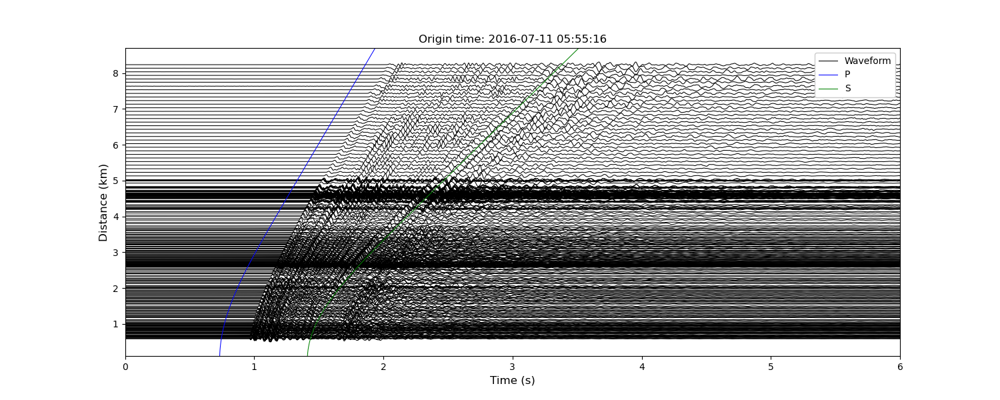

Example Data
============
In the entire tutorial, we shall use an example dataset returned by ``SeisScan.read_example`` function. The dataset contains event informatin (Quinones, 2021), waveform stream and station metadata from IRIS fullwaveform experiment in Oklahoma (Sweet et al., 2018).

>>> from obspy import UTCDateTime
>>> import SeisScan as ss
>>>
>>> event_dict, st_main, inventory, subnetworks, model_name = ss.read_example()

The function returns four quantities which are described below.

  **event_dict** is a ``dictionary`` containing event information.

  **st_main** is an ``ObsPy.Stream`` with station metadata added.

  **inventory** is an ``ObsPy.Inventory`` of station metadata.

  **subnetworks** is a list of ``Subnetwork``.

  **model_name** is an earth model name.

Extract the event information.

>>> evt0 = UTCDateTime(event_dict["evt0"])    # event origin time
>>> evlo = event_dict["evlo"]                 # event longitude
>>> evla = event_dict["evla"]                 # event latitude
>>> evdp = event_dict["evdp"]                 # event depth (km)
>>> mag = event_dict["mag"]                   # event magnitude

Print the ``Subnetworks``.

>>> print(subnetworks)
    [{'reference': '1002', 'secondaries': ['1001', '1003']},
     {'reference': '1041', 'secondaries': ['5019', '5020', '5025', '5026']},
     {'reference': '1073', 'secondaries': ['5004', '5005', '5012', '5013']},
     {'reference': '1128', 'secondaries': ['1127', '1129']},
     {'reference': '2005', 'secondaries': ['2004', '2006']},
     {'reference': '2048', 'secondaries': ['2047', '2049']},
     {'reference': '3002', 'secondaries': ['3001', '3003']},
     {'reference': '3048', 'secondaries': ['3047', '3049']}]

Plot a record section of the stream using ``SeisScan.prs`` function.

>>> ss.prs(st_main.select(channel="DPZ"),
           evt0, evlo, evla, evdp, scale=0.1, model_name=model_name,
           xmin=0.0, xmax=6.0, width=15, height=6, handle=True)

Select Stream for the stations in the ``Subnetworks``.

>>> st = Stream()
>>> 
>>> for subnetwork in subnetworks:
>>>     reference = subnetwork["reference"]
>>>     secondaries = subnetwork["secondaries"]
>>>     
>>>     st += st_main.select(station=reference)
>>>     
>>>     for secondary in secondaries:
>>>         st += st_main.select(station=secondary)

Plot a record section of the selected stream

>>> ss.prs(st.select(channel="DPZ"),
>>>        evt0, evlo, evla, evdp, scale=0.5, model_name=model_name,
>>>        xmin=0.0, xmax=6.0, width=15, height=6, handle=True)

**References**

1. Quinones L. 2021. Tracking induced seismicity in the Fort Worth Basin, Texas and Northern Oklahoma using local and large‐N style arrays, Earth Sci. Theses and Dissertations 22 , available at https://scholar.smu.edu/hum_sci_earthsciences_etds/22.

2. Sweet J. R. Anderson K. R. Bilek S. L. Brudzinski M. Chen X. DeShon H. Hayward C. Karplus M. Keranen K., and Langston C., et al. 2018. A community experiment to record the full seismic wavefield in Oklahoma, Seismol. Res. Lett.  89, no. 5, 1923–1930, doi:https://doi.org/10.1785/0220180079.
